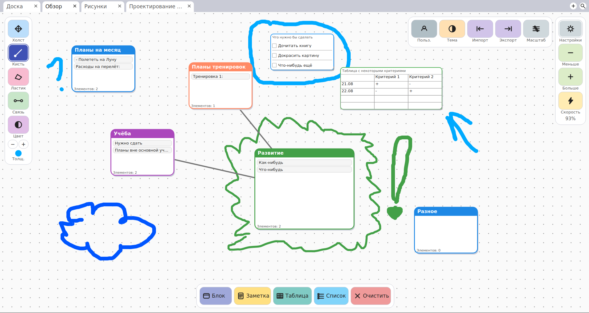

# Интерактивная доска
#### Бесконечная доска, которую должно быть удобно использовать для организации своих мыслей/идей, планирования или хранения полезных текстов



## Практические возможности:
- Бесконечная плоскость для рисования и/или организации пространства
- Заметки (с базовым оформлением)
- Списки
- Таблицы
- Блоки внутри доски, где ___можно создать отдельное подпространство___ со своими заметками, списками, таблицами и рисунками

## Полезные функции, которые есть на данный момент и которые могут несколько улучшить использование приложения:
- изменение размера интерфейса доски
- смена цветовой темы (светлая/тёмная)
- возможность экспорта содержимого доски в XML/JSON/PNG/ODS (последнее экспериментально)
- возможность импорта содержимого какой-либо доски из JSON-файла с данными доски
- скоростной режим (отключение анимации интерфейса и скругления углов)
- возможность использования сразу нескольких досок одновременно (вкладки)
- возможность использования доски несколькими пользователями с раздельным хранением данных (данные досок каждого пользователя сохраняются в отдельном JSON-файле)
- отмена действий (Ctrl+Z)
- возможность поиска каких-либо элементов на главном экране по их содержимому или названию (на данный момент не затрагивает элементы внутри блоков)

## Запуск
Для запуска приложения необходимо загрузить библиотеку **PyQt5** через pip (при уже установленом Python):
```
pip install pyqt5
```

После загрузки для открытия самого приложения в командной строке/терминале нужно ввести:
```
python desk.py
```
Готово.
